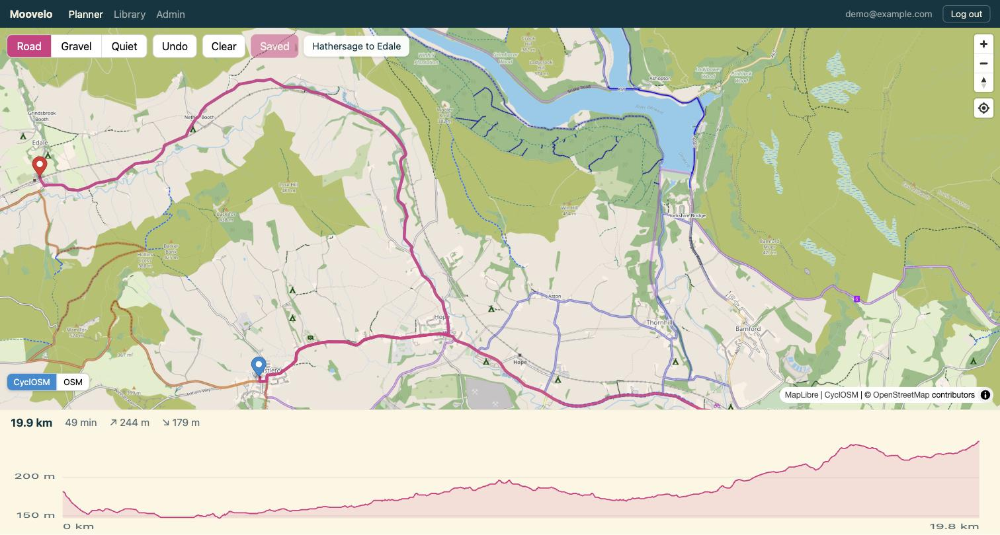
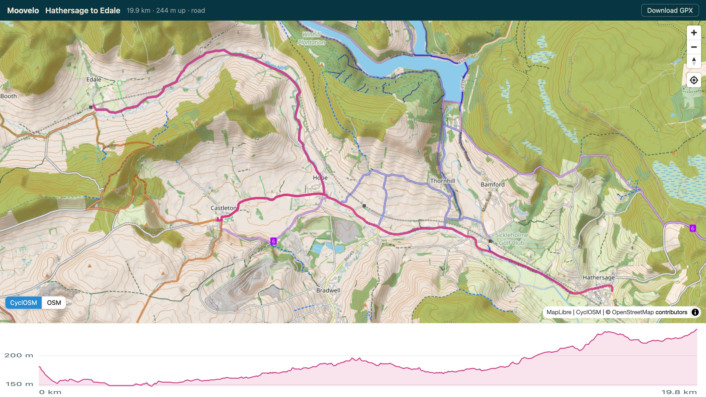
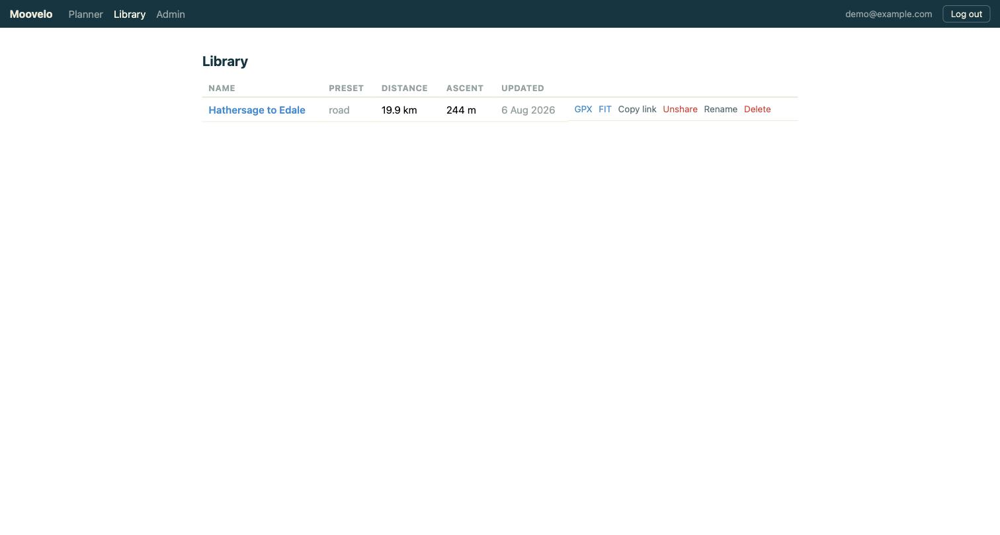
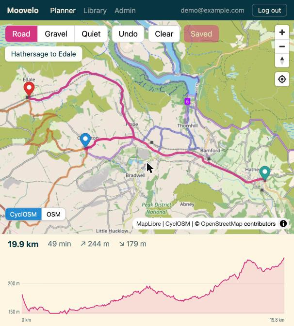
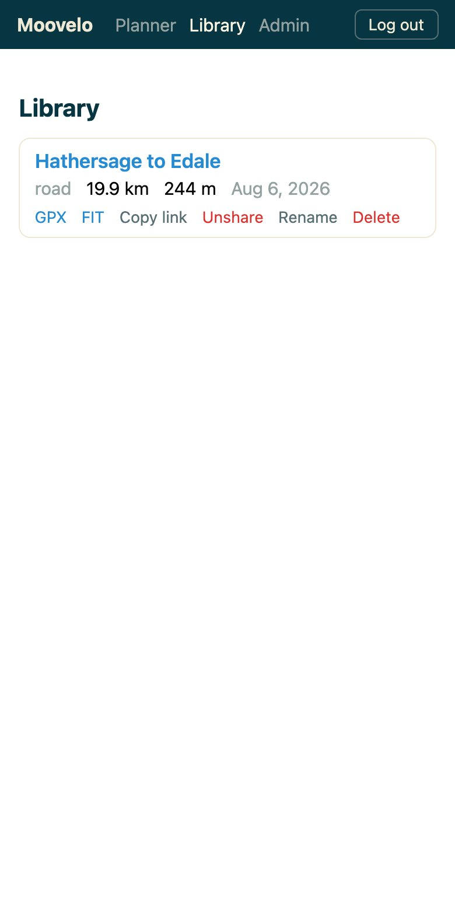

# Moovelo

Moovelo is a self-hosted bike route planner for cyclists who'd rather run
their own routing stack than hand ride data to a commercial platform. It's
for anyone who wants full-featured route planning - click-to-plan routing,
elevation and gradient, a real route library, turn-by-turn Wahoo sync -
running entirely on hardware they control: `docker compose up` and it's
yours, with no account on someone else's servers and no data leaving your
network unless you explicitly connect Wahoo or a weather provider.

Plan routes in the browser on a cycling-oriented map, save them to your
library, export GPX/FIT, and push them straight to your Wahoo head unit -
with turn-by-turn cues.

## Features

- Click-to-plan routing: click the map to add waypoints, drag any waypoint
  marker to move it, or grab the route line itself and drag it to insert a
  via point exactly where you drop it. Right-click for a
  context menu (route from here, add waypoint, route to here, remove).
- Multi-step undo/redo over the whole editing session - not just the last
  waypoint - with Cmd/Ctrl+Z and Cmd/Ctrl+Shift+Z alongside the toolbar
  buttons. Clearing the route is undoable too.
- Waypoint list panel: every waypoint in route order, named via reverse
  geocoding where the place index is available, with up/down and remove
  buttons on each row and drag-and-drop reordering. The buttons are the
  accessible and touch path (drag-and-drop fires no events on touch), not
  just a fallback.
- Loop generator: "20 km loop from here" on the right-click menu tries
  several bearings around that point and binary-searches each one's radius
  until it finds an out-and-back route close to your target distance,
  scored on distance accuracy, climbing and surface mix. Up to three
  distinct candidates are previewed on the map together; picking one lands
  as an ordinary, already-routed, editable route - no round trip back
  through the planner. Valhalla has no round-trip API of its own, so this
  is built entirely from routing calls it already exposes.
- Three bicycle presets - road, gravel, quiet - implemented as Valhalla
  costing bundles with genuinely different routing behavior (see
  [Routing presets](#routing-presets)). A "Custom…" pill exposes the same
  costing options as sliders (bike type, speed, road preference, hills,
  surface avoidance), per user, with your own named presets saved and
  reused across routes.
- Elevation profile under the map with total ascent/descent and a hover
  marker synced to the route.
- Personal route library backed by Postgres/PostGIS: save, rename, reload,
  and share routes, with tags, notes and favourites for organising them.
  Tags rather than folders - a route can be both "gravel" and "with the
  kids". Search across names and notes, filter by tag, favourite or
  planned/imported, and sort by date, name, distance or climbing.
  Duplicate a route, or reverse one to ride it the other way - reversing
  re-routes rather than flipping the line, so one-ways and turn cues stay
  correct.
- GPX and FIT export from either the planner or the library - the FIT
  files carry Valhalla's turn-by-turn maneuvers as course points, so a
  Wahoo ELEMNT shows cues on the ride.
- Import GPX, TCX and FIT files - drop them anywhere in the app or use the
  Import button in the library. Imported tracks are map-matched back onto
  the road network, so a file that arrived with no instructions comes out
  with turn-by-turn cues and can be pushed to a head unit. A track that
  cannot be matched is kept as-is rather than rejected, and says so.
- "Send to Wahoo": push routes to your Wahoo account over the Cloud API;
  they appear on the ELEMNT after its next WiFi sync. Queued in the
  background with per-route status; re-pushing updates the same course.
- Optional AI route assistant, off unless you configure an endpoint: ask
  for a route in the planner ("a 40 km gravel loop from here, with water
  on it") and watch the answer stream back as it works. It calls the same
  routing, search and loop primitives the rest of the app uses - it never
  invents coordinates or distances - and whatever it produces arrives as
  a previewed offer you accept or discard, landing as ordinary waypoints
  you can drag and undo like any other edit. Points at any OpenAI-compatible
  endpoint, including a local Ollama.
- Public read-only share links per route - send a route to someone
  without an account. When the route assistant is configured, the share
  page also carries a short natural-language summary of the route,
  generated once when the link is created.
- Simple auth: email + password, first user becomes admin, signups gated
  by a flag. Optional OIDC single sign-on (Pocket ID, Authelia, Keycloak,
  ...), including an SSO-only mode, plus a minimal /admin page.
- CyclOSM cycling basemap with an OSM standard fallback toggle, plus
  optional fully self-hosted tiles (see
  [docs/self-hosted-tiles.md](docs/self-hosted-tiles.md)).
- Optional offline place index, built from the same OpenStreetMap extract
  the router already downloaded - no Nominatim, no Overpass, nothing
  leaves your network. One opt-in command
  (`docker compose --profile index run --rm indexer`) turns 1.6 GB of
  England into roughly 73,000 searchable places, 285,000 cycling POIs
  (water, cafes, bike shops, toilets, viewpoints, campsites) and 5,500
  signed cycle routes, in about 37 seconds. See
  [docs/data.md](docs/data.md).
- With that index built, the planner gains a search box, place names on
  the map's right-click menu, and a save dialog that opens on "Tring to
  Ivinghoe Beacon" instead of today's date.
- Water, coffee, toilets and bike shops along a route, listed in the
  order you will pass them and shown on the map, with opening hours where
  OpenStreetMap has them.
- Toggleable overlay of the signed cycle network (NCN, RCN, LCN), served
  as vector tiles. Most useful on the OSM standard basemap, since CyclOSM
  already draws the national network itself.
- Search for a place from the planner once that index exists: type a few
  letters, arrow through the results, and start, extend or end a route
  from any of them. Typos are forgiven ("birmingam" finds Birmingham) and
  results prefer the part of the map you are looking at, which matters
  because 21,848 English places share a name with another.
- Isochrones: right-click any point on the map for "Isochrone from here" and
  see how far you can get in N minutes, drawn as a polygon overlay. Entirely
  self-hosted via Valhalla's own `/isochrone` - no third-party service.
- Alternate routes for a straight A-to-B ride: an "Alternatives" button asks
  Valhalla for other reasonable ways between the same two points, previewed
  as ghost lines on the map with the distance/climbing difference against
  what's on screen, and adopting one is undoable like any other edit. Only
  available for a route with exactly one start and one finish - Valhalla's
  own `alternates` option has no meaning for a route with via points, so the
  button is disabled (with an explanation) the moment a route has more than
  two waypoints.
- Avoids: right-click a point on the route line for "Avoid this road", which
  re-plans the route excluding it (Valhalla's `exclude_locations`). Avoided
  points show as small markers with a chip you can remove. Avoided roads
  apply while planning and are not saved with a route - the saved geometry
  already reflects them.
- Entirely self-hostable: routing (Valhalla), app, database, and
  optionally the map tiles run on your own hardware. The only external
  services are Wahoo's cloud, an optional weather provider and an
  optional AI route assistant endpoint, and only if you configure them.
- Activity history: import your own rides (GPX/TCX/FIT, or a Strava bulk
  export zip) into a separate library from planned routes, and see them as
  a personal heatmap - a low-opacity trace of every ride, drawn on the map
  so roads you ride more than once darken. With the place index built, a
  coverage card on /activities shows how much of the signed cycle network
  near you has actually been ridden, per network tier, and (with the
  opt-in all-roads index) how much of every bikeable road near you has,
  both from your own activities map-matched onto OpenStreetMap way ids.
  Nothing here leaves your network - see the
  [FAQ](docs/faq.md#does-any-of-my-data-leave-my-network).
- Ride-to-route matching: an imported ride is automatically linked to the
  saved route it followed, so /activities can show "this ride was your
  Canal loop route" without you saying so. Matching is entirely geometric -
  a cheap bounding-box narrowing over your own routes, confirmed with
  PostGIS's `ST_FrechetDistance` (line-shape similarity, not just endpoint
  distance, and checked in both directions so a route ridden backwards
  still matches) - no external service, and it never looks at another
  rider's routes. The distance threshold is provisional and will be tuned
  against real ride data; you can always correct or clear a match by hand
  (`PUT /api/activities/{id}/route`), which locks it so a later automatic
  pass never overwrites your choice.

## Route intelligence

- Surface breakdown: a stacked bar showing what a route is made of - paved,
  gravel, path - plus the share on marked cycling infrastructure, from
  Valhalla's own per-edge data over the route's exact line. The honest
  answer to "will my road bike cope". Decorative rather than authoritative:
  it never blocks saving, exporting or pushing a route, and degrades
  quietly when the line cannot be matched back onto the road network.
- Gradient colouring: the elevation profile and the map route line are
  coloured by gradient band (descent, 0-3, 3-6, 6-9, 9-12, 12%+), sharing
  the same maths so a red stretch on the chart is the same red stretch on
  the map. A route without elevation data keeps the plain line.
- Climb detection: the elevation profile is segmented into climbs and
  categorised (HC down to 4, road-cycling style) by a backend algorithm with
  its own smoothing pass over the noisy /height data. Climbs are listed
  beside the chart; hovering one highlights its stretch on both the chart
  and the map.
- Realistic ride time: the planner's displayed time is a per-rider estimate
  over gradient and surface, not Valhalla's flat routing duration. Set your
  weight, flat-road speed and (optionally) FTP at /settings, and every
  route - including ones already saved - shows a time for you. Computed
  fresh on every read, so it never needs re-saving when your settings
  change; the export/Wahoo-sync duration is untouched.
- Weather and wind along a route (optional, see
  [Weather and wind](#weather-and-wind)): head/tailwind and speed at points
  sampled along the ride, timed to when you expect to reach each one.

## Screenshots

Planning a route in the Peak District (CyclOSM basemap, elevation profile):



A public share link - read-only map, elevation, GPX download, no account
needed:



The route library, and the planner and library on a phone:



<p>


</p>

## Quickstart (development)

Requirements: Docker with Compose v2, roughly 8 GB RAM allocated to Docker,
and about 10 GB of disk for routing data.

```sh
cp .env.example .env
docker compose --profile dev up
```

Open http://localhost:5173.

First start: Valhalla downloads the configured OSM extract plus elevation
data and builds routing tiles into a named volume. Build time depends
heavily on hardware - minutes on a fast machine, up to an hour or two on
modest hardware for the default England extract. Subsequent starts reuse
the tiles and are fast.

For quick iteration, point `VALHALLA_TILE_URL` in `.env` at a small region
first (a single county builds in a couple of minutes - see `.env.example`).

## Quickstart (production)

```sh
cp .env.example .env   # adjust as needed
docker compose --profile prod up -d          # pulls ghcr.io/beaglemoo/moovelo (amd64/arm64)
# ...or build the image yourself from source:
docker compose --profile prod up -d --build
```

The prod profile builds the frontend into the backend image and serves the
whole app from a single container on port 17777 (configurable via
`APP_PORT`). Put a reverse proxy with TLS in front of it - a Caddy snippet
is provided in [deploy/](deploy/).

## Configuration

All configuration is via environment variables, documented in
[.env.example](.env.example):

| Variable | Default | Purpose |
|----------|---------|---------|
| `VALHALLA_TILE_URL` | Geofabrik england | OSM extract(s) for routing, space-separated URLs |
| `VALHALLA_BUILD_ELEVATION` | `True` | Download elevation data (hill-aware routing + profiles) |
| `VALHALLA_SERVER_THREADS` | all cores | Valhalla build/serve threads |
| `TILE_URL_CYCLOSM` | unset | Self-hosted CyclOSM tile server template; unset uses the public servers |
| `INDEX_ROADS` | `false` | Opt-in indexer sidecar only: index every bikeable OSM way (not just the signed cycle network) for all-roads coverage. Adds ~8 minutes and ~1.24 GB to a full England rebuild |
| `APP_PORT` | `17777` | Host port for the prod profile |
| `POSTGRES_PASSWORD` | `bikegps` | Database password - change for prod |
| `SIGNUPS_ENABLED` | `false` | Allow registrations beyond the first (admin) user |
| `COOKIE_SECURE` | `false` | Set `true` when serving over HTTPS |
| `APP_URL` | unset | External base URL, needed for OIDC and Wahoo callbacks |
| `OIDC_ISSUER` / `OIDC_CLIENT_ID` / `OIDC_CLIENT_SECRET` | unset | Enable OIDC SSO (all three required) |
| `OIDC_PROVIDER_NAME` | `Pocket ID` | Label on the SSO login button |
| `PASSWORD_AUTH_ENABLED` | `true` | Set `false` for SSO-only login (ignored unless OIDC is configured) |
| `WAHOO_CLIENT_ID` / `WAHOO_CLIENT_SECRET` | unset | Enable Wahoo sync (see [Wahoo sync](#wahoo-sync)) |
| `WEATHER_API_URL` | unset | Enable the weather panel (see [Weather and wind](#weather-and-wind)) |
| `LLM_BASE_URL` / `LLM_MODEL` | unset | Enable the route assistant (both required; any OpenAI-compatible endpoint) |
| `LLM_API_KEY` | unset | API key for the above; a local endpoint usually needs none |
| `LLM_PROVIDER_ORDER` | unset | OpenRouter only - comma-separated provider preference |

Rider settings (weight, flat-road speed, optional FTP) are the first thing
in this project configured in-app rather than by environment variable -
per-user, at `/settings`. They feed the realistic ride-time estimate (see
[Route intelligence](#route-intelligence)) shown throughout the planner and
library.

## Routing presets

The three presets map to Valhalla bicycle costing-option bundles, chosen so
they produce visibly different routes (exact values and rationale in
[backend/app/services/presets.py](backend/app/services/presets.py)):

| Preset | Bike | Behavior |
|--------|------|----------|
| road | Road | Fast tarmac riding; comfortable on carriageways, hard-avoids unpaved surfaces |
| gravel | Cross | Seeks out unpaved tracks, towpaths, and bridleways; biased away from tarmac |
| quiet | Hybrid | Strongly prefers cycleways and calm streets; softens climbs |

The API accepts the preset name per request, and the option bundles are
plain dictionaries - any single option can become a user-facing slider
later without an API change. The "Custom…" pill does exactly that: bike
type, cycling speed, and the three 0-1 sliders above are all directly
editable, and a custom bundle overrides the preset entirely rather than
blending with it. Save a bundle as a named preset to reuse it on other
routes; presets are per-user and stored server-side.

## Map tiles

The map defaults to CyclOSM raster tiles from the public community servers,
with an OSM standard layer as an in-app fallback toggle (bottom-left of the
map). The public CyclOSM servers render uncached high-zoom tiles on demand,
which can take seconds per tile in less-visited areas.

For a fully self-hosted setup, run your own CyclOSM tile server and set
`TILE_URL_CYCLOSM` - the complete guide is in
[docs/self-hosted-tiles.md](docs/self-hosted-tiles.md).

## Wahoo sync

Saved routes can be pushed straight to your Wahoo account so they appear
on your ELEMNT after its next WiFi sync - as a FIT course with
turn-by-turn cues. Your instance never needs to be exposed to the
internet for this to work.

The short version: register a (free, instantly-approved) sandbox app at
https://developers.wahooligan.com with redirect URI
`<APP_URL>/api/wahoo/callback`, put the client ID and secret in `.env`,
restart, and hit "Connect Wahoo" in the library.

The full walkthrough - registration form gotchas, how the queue and
statuses work, and troubleshooting - is in
[docs/wahoo-sync.md](docs/wahoo-sync.md).

## Weather and wind

Set `WEATHER_API_URL` to an Open-Meteo-compatible forecast base URL (e.g.
`https://api.open-meteo.com/v1/forecast`, no API key needed for personal
use - or point it at a self-hosted mirror) and a "Show wind" panel appears
under the elevation profile. Pick a start time and it samples wind roughly
every 10 km along the route, timed to when you would reach each point, and
shows speed plus a head/tailwind reading for each.

Like Wahoo sync, this is off by default: unset, the panel is not shown at
all, and it never makes a request on its own - only pressing "Show wind"
does. See [docs/architecture.md](docs/architecture.md#weather-and-wind)
for the sampling and wind maths.

## Documentation

- [docs/guide.md](docs/guide.md) - the rider's guide: every feature, how to use it
- [docs/faq.md](docs/faq.md) - common questions, answered honestly
- [docs/troubleshooting.md](docs/troubleshooting.md) - symptom-first fixes for common gotchas
- [docs/architecture.md](docs/architecture.md) - components, data flow, and design decisions
- [docs/data.md](docs/data.md) - OSM extracts, elevation data, refreshing routing data
- [docs/self-hosted-tiles.md](docs/self-hosted-tiles.md) - running your own CyclOSM tile server
- [docs/wahoo-sync.md](docs/wahoo-sync.md) - full Wahoo setup walkthrough and troubleshooting
- [deploy/](deploy/) - production reverse-proxy notes and Caddy snippet
- [CONTRIBUTING.md](CONTRIBUTING.md) - development setup, tests, and PR conventions

## Development

Backend (Python 3.12, FastAPI, uv):

```sh
cd backend
uv sync
uv run pytest          # tests
uv run ruff check .    # lint
uv run mypy            # types (strict)
```

Frontend (SvelteKit, TypeScript, npm):

```sh
cd frontend
npm install
npm run check          # svelte-check
npm run lint           # prettier + eslint
npm run build          # production build
```

The dev compose profile runs both with hot reload (backend source and
frontend source are bind-mounted).

## License

[MIT](LICENSE). Contributions welcome - see
[CONTRIBUTING.md](CONTRIBUTING.md).
