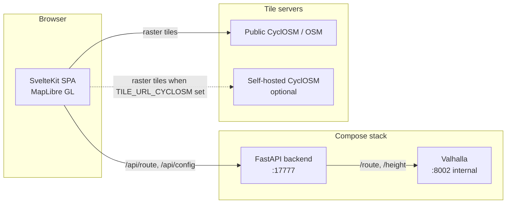

# Architecture

## Components



| Component | Technology | Role |
|-----------|------------|------|
| frontend | SvelteKit + MapLibre GL JS, static SPA build | Planner UI: map, waypoints, presets, elevation chart |
| backend | Python 3.12, FastAPI, httpx | API and static file host; proxies all Valhalla calls |
| valhalla | Official `valhalla-scripted` image | Bicycle routing and elevation; never exposed directly |

## Request flow for a route

1. The browser POSTs `/api/route` with waypoints and a preset name.
2. The backend looks up the preset's bicycle costing bundle
   (`backend/app/services/presets.py`) and calls Valhalla `/route`.
3. The backend decodes the returned polyline6 legs, resamples the shape to
   at most 500 points, and calls Valhalla `/height` for the elevation
   profile. If elevation data was not built, the route still succeeds with
   an empty profile.
4. The response carries per-leg geometry (polyline6) and the raw Valhalla
   maneuvers untouched - these are preserved end-to-end because later
   phases embed them as FIT course points for turn-by-turn cues on the
   head unit - plus summary stats and the elevation series.
5. The frontend decodes the legs, renders the route line, and tracks which
   shape indices belong to which leg so that dragging the line knows where
   to insert the new via waypoint.

## Frontend structure

```
frontend/src/
├── routes/+page.svelte          # planner page: state, reroute orchestration
└── lib/
    ├── api.ts                   # backend client + response types
    ├── polyline.ts              # polyline6 decoder
    ├── geo.ts                   # haversine, distance interpolation helpers
    ├── map/MapView.svelte       # MapLibre init, layers, interactions, basemap toggle
    └── components/
        ├── PresetSelector.svelte
        └── ElevationProfile.svelte   # custom SVG chart, no chart library
```

State lives in `+page.svelte` with Svelte 5 runes; `MapView` receives
plain props plus callbacks. Route requests are aborted (AbortController)
when superseded, so rapid dragging never queues stale reroutes.

Drag-to-reroute works with an invisible wide "hit" twin of the route line:
mousedown on it suppresses map panning, a ghost point follows the cursor,
and on drop the grabbed vertex's leg determines the insertion position for
the new via waypoint.

## Backend structure

```
backend/app/
├── main.py                  # app factory, CORS, static mount (prod)
├── config.py                # pydantic-settings, all env-driven
├── api/route.py             # /api/health, /api/config, /api/route
├── schemas.py               # request/response models
└── services/
    ├── presets.py           # the three costing bundles + rationale
    ├── polyline.py          # polyline6 decoder
    └── valhalla.py          # httpx client, error mapping, elevation, ascent calc
```

Error mapping: Valhalla connection failures surface as 503 ("routing
engine unavailable - it may still be building tiles"); Valhalla 4xx
responses surface as 422 with the Valhalla error message, plus a hint
about extract coverage when no roads are found near a waypoint.

## Design decisions

- **Valhalla behind the backend**: the routing engine is never exposed;
  one origin serves everything in prod, so no CORS in production and the
  Valhalla admin surface stays private.
- **Polyline6 to the browser** rather than raw coordinates: about 10x
  smaller responses on long routes; the decoder is 25 lines.
- **Elevation via /height** rather than baking heights into route
  responses: keeps the route call fast and lets elevation degrade
  gracefully when tiles were built without it.
- **Maneuvers pass through untouched**: FIT course points (Phase 2) need
  Valhalla's original maneuver types, instructions, and shape indices;
  transforming them earlier would lose information.
- **Static SPA served by the backend** in prod: single container, single
  port, no SSR complexity - the app is a map tool, not a content site.
- **Compose profiles over separate files**: `dev` (hot reload, mounted
  source, Vite on 5173) and `prod` (single container on 17777) live in one
  docker-compose.yml.

## Ports

| Service | Port | Exposure |
|---------|------|----------|
| Vite dev server | 5173 | localhost only, dev profile |
| Backend | 17777 | localhost in dev; host port in prod (reverse proxy in front) |
| Valhalla | 8002 | compose network only, never published |
