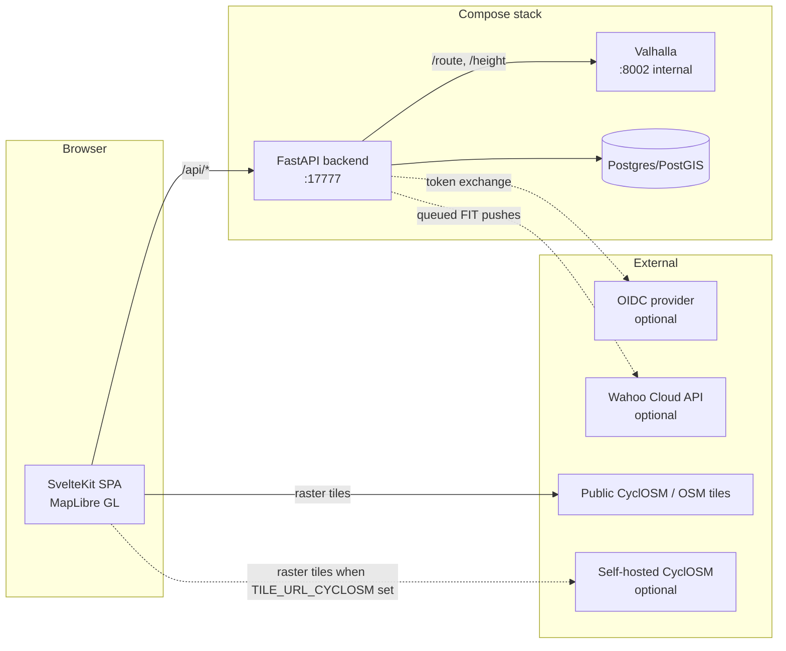

# Architecture

## Components



| Component | Technology | Role |
|-----------|------------|------|
| frontend | SvelteKit + MapLibre GL JS, static SPA build | Planner, library, admin, share pages |
| backend | Python 3.12, FastAPI, SQLAlchemy async, httpx | API + static host; proxies Valhalla, talks to Wahoo |
| postgres | PostGIS 16 | Users, sessions, routes (geometry + snapshot), Wahoo tokens |
| valhalla | Official `valhalla-scripted` image | Bicycle routing and elevation; never exposed directly |

## Request flow for a route

1. The browser POSTs `/api/route` with waypoints and a preset name.
2. The backend looks up the preset's bicycle costing bundle
   (`backend/app/services/presets.py`) and calls Valhalla `/route`.
3. The backend decodes the returned polyline6 legs, resamples the shape to
   at most 500 points, and calls Valhalla `/height` for the elevation
   profile. If elevation data was not built, the route still succeeds with
   an empty profile.
4. The response carries per-leg geometry (polyline6) and the raw Valhalla
   maneuvers untouched - these are preserved end-to-end because later
   phases embed them as FIT course points for turn-by-turn cues on the
   head unit - plus summary stats and the elevation series.
5. The frontend decodes the legs, renders the route line, and tracks which
   shape indices belong to which leg so that dragging the line knows where
   to insert the new via waypoint.

## Persistence and auth

Routes are stored with their full response snapshot (legs with geometry
and maneuvers, elevation series, stats) as JSONB plus a PostGIS
linestring of the merged shape. Saving never re-routes; loading a saved
route replays the snapshot. Alembic migrations run on backend startup.

Auth is session-cookie based: argon2 password hashes, a sha256-hashed
token in a `sessions` table with a 30-day sliding expiry. The first
registered user becomes admin; further signups are gated by
`SIGNUPS_ENABLED`. Optional OIDC SSO (authorization-code flow, state
cookie, email matching) works with any generic provider;
`PASSWORD_AUTH_ENABLED=false` hides password login entirely but is
ignored unless OIDC is configured, so it can never lock you out. Admin
accounts get a minimal `/admin` page (users, stats, config overview).

## Wahoo sync

`services/wahoo.py` implements OAuth against api.wahooligan.com (tokens
per-user in Postgres, proactively refreshed) and the push itself: the
route's FIT file - maneuvers embedded as course points - is uploaded as
a multipart `route.fit` attachment to POST/PUT `/v1/routes` with our
route UUID as `external_id`, so re-pushes update the same course.
(Wahoo rejects the base64 data-URI upload form its docs describe, and
requires `workout_type_family_id` and start coordinates.)

Pushes never block requests: `services/wahoo_queue.py` runs a single
asyncio worker draining an in-process queue, which also serializes calls
under Wahoo's sandbox rate limits (25/5min). Status lives on the route
row (`queued -> pushing -> synced/error`), the UI polls it, and startup
re-enqueues anything stranded mid-push by a restart. Retries honor 429
Retry-After; a 401 triggers one token refresh; PUT on a vanished route
falls back to POST.

## Share links

A route can be shared read-only: `POST /api/routes/{id}/share` sets a
random `share_token` on the row (rotating it invalidates old links,
DELETE revokes). `GET /api/shared/{token}` and `.../export.gpx` are the
only unauthenticated data endpoints, serving the snapshot and GPX by
token only - no route ids, no owner information.

## Frontend structure

```
frontend/src/
├── routes/
│   ├── +layout.svelte           # auth guard + nav
│   ├── +page.svelte             # planner: state, reroute + save + wahoo orchestration
│   ├── login/+page.svelte       # password and/or SSO login
│   ├── library/+page.svelte     # saved routes, exports, wahoo, share
│   ├── admin/+page.svelte       # users/stats/config (admins)
│   └── s/[token]/+page.svelte   # public read-only shared route
└── lib/
    ├── api.ts                   # backend client + response types
    ├── polyline.ts              # polyline6 decoder
    ├── geo.ts                   # haversine, distance interpolation helpers
    ├── map/MapView.svelte       # MapLibre init, layers, interactions, basemap toggle
    └── components/
        ├── PresetSelector.svelte
        └── ElevationProfile.svelte   # custom SVG chart, no chart library
```

State lives in `+page.svelte` with Svelte 5 runes; `MapView` receives
plain props plus callbacks. Route requests are aborted (AbortController)
when superseded, so rapid dragging never queues stale reroutes.

Drag-to-reroute works with an invisible wide "hit" twin of the route line:
mousedown on it suppresses map panning, a ghost point follows the cursor,
and on drop the grabbed vertex's leg determines the insertion position for
the new via waypoint.

## Backend structure

```
backend/app/
├── main.py                  # app factory, lifespan (valhalla client, wahoo worker), SPA static
├── config.py                # pydantic-settings, all env-driven
├── db.py                    # async engine + session factory
├── models.py                # User, Session, Route, WahooAccount
├── schemas.py               # request/response models
├── api/
│   ├── route.py             # /api/health, /api/config, /api/route
│   ├── auth.py              # register/login/logout/me + OIDC flow
│   ├── routes.py            # route CRUD, GPX/FIT export, share links
│   ├── wahoo.py             # connect/callback/status/push
│   └── admin.py             # /api/admin (admin accounts only)
├── alembic/                 # migrations, run on startup
└── services/
    ├── presets.py           # the three costing bundles + rationale
    ├── polyline.py          # polyline6 decoder
    ├── valhalla.py          # httpx client, error mapping, elevation, ascent calc
    ├── auth.py, oidc.py     # password hashing, sessions, OIDC client
    ├── gpx.py, fit.py       # exporters (FIT embeds maneuvers as course points)
    └── wahoo.py, wahoo_queue.py  # Wahoo client + background push worker
```

Error mapping: Valhalla connection failures surface as 503 ("routing
engine unavailable - it may still be building tiles"); Valhalla 4xx
responses surface as 422 with the Valhalla error message, plus a hint
about extract coverage when no roads are found near a waypoint.

## Design decisions

- **Valhalla behind the backend**: the routing engine is never exposed;
  one origin serves everything in prod, so no CORS in production and the
  Valhalla admin surface stays private.
- **Polyline6 to the browser** rather than raw coordinates: about 10x
  smaller responses on long routes; the decoder is 25 lines.
- **Elevation via /height** rather than baking heights into route
  responses: keeps the route call fast and lets elevation degrade
  gracefully when tiles were built without it.
- **Maneuvers pass through untouched**: FIT course points need Valhalla's
  original maneuver types, instructions, and shape indices; transforming
  them earlier would lose information.
- **Snapshot-based persistence**: saved routes replay their stored
  response instead of re-routing, so a library route never silently
  changes when routing data is refreshed.
- **In-process push queue** rather than a broker: a single worker task is
  plenty for a personal instance, serializes calls under Wahoo's rate
  limits, and route-row status makes it restart-safe without extra
  infrastructure.
- **Static SPA served by the backend** in prod: single container, single
  port, no SSR complexity - the app is a map tool, not a content site.
- **Compose profiles over separate files**: `dev` (hot reload, mounted
  source, Vite on 5173) and `prod` (single container on 17777) live in one
  docker-compose.yml.

## Ports

| Service | Port | Exposure |
|---------|------|----------|
| Vite dev server | 5173 | localhost only, dev profile |
| Backend | 17777 | localhost in dev; host port in prod (reverse proxy in front) |
| Valhalla | 8002 | compose network only, never published |
| Postgres | 5433 | 127.0.0.1 only (used by the backend test suite) |
