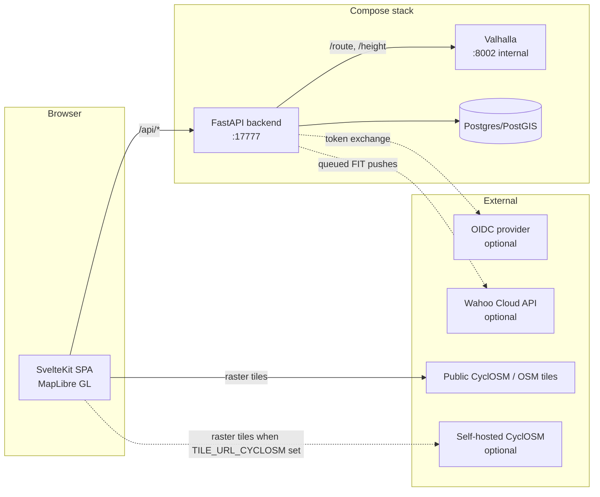

# Architecture

## Components



| Component | Technology | Role |
|-----------|------------|------|
| frontend | SvelteKit + MapLibre GL JS, static SPA build | Planner, library, admin, share pages |
| backend | Python 3.12, FastAPI, SQLAlchemy async, httpx | API + static host; proxies Valhalla, talks to Wahoo |
| postgres | PostGIS 16 | Users, sessions, routes (geometry + snapshot), Wahoo tokens |
| valhalla | Official `valhalla-scripted` image | Bicycle routing and elevation; never exposed directly |

## Request flow for a route

1. The browser POSTs `/api/route` with waypoints and a preset name.
2. The backend looks up the preset's bicycle costing bundle
   (`backend/app/services/presets.py`) and calls Valhalla `/route`.
3. The backend decodes the returned polyline6 legs, resamples the shape to
   at most 500 points, and calls Valhalla `/height` for the elevation
   profile. If elevation data was not built, the route still succeeds with
   an empty profile.
4. The response carries per-leg geometry (polyline6) and the raw Valhalla
   maneuvers untouched - these are preserved end-to-end because later
   phases embed them as FIT course points for turn-by-turn cues on the
   head unit - plus summary stats and the elevation series.
5. The frontend decodes the legs, renders the route line, and tracks which
   shape indices belong to which leg so that dragging the line knows where
   to insert the new via waypoint.

## Persistence and auth

Routes are stored with their full response snapshot (legs with geometry
and maneuvers, elevation series, stats) as JSONB plus a PostGIS
linestring of the merged shape. Saving never re-routes; loading a saved
route replays the snapshot. Alembic migrations run on backend startup.

Auth is session-cookie based: argon2 password hashes, a sha256-hashed
token in a `sessions` table with a 30-day sliding expiry. The first
registered user becomes admin; further signups are gated by
`SIGNUPS_ENABLED`. Optional OIDC SSO (authorization-code flow, state
cookie, email matching) works with any generic provider;
`PASSWORD_AUTH_ENABLED=false` hides password login entirely but is
ignored unless OIDC is configured, so it can never lock you out. Admin
accounts get a minimal `/admin` page (users, stats, config overview).

## The place index

`places`, `pois` and `cycle_ways` hold settlements, useful stops and
signed cycle routes parsed out of the same OpenStreetMap extract Valhalla
already downloads. Nothing external is involved: no Nominatim, no
Overpass, no outbound calls.

These four tables are the only ones the app never writes. An opt-in
indexer sidecar (`indexer/`, compose profile `index`) fills them; the
backend reads them. It mounts the `valhalla_tiles` volume read-only and
works in three stages:

1. **`osmium tags-filter`** streams the extract down to just the tagged
   objects and the nodes and members they reference - 1.6 GB to 45 MB for
   England, in about nine seconds. This is what keeps the rest cheap:
   parsing the whole extract with node-location caching would be the
   largest memory consumer on the machine. (The `-R` flag looks like it
   would help and does the opposite - it *omits* referenced objects,
   which would leave every way without coordinates.)
2. **Two pyosmium passes.** The first reads relations only and flattens
   cycle superroutes, because a route relation can have other relations
   as members and a child is not guaranteed to appear before its parent.
   The second resolves geometry and streams rows out.
3. **COPY into staging, then one publishing transaction.** The minutes of
   work happen outside any lock; only the row move is inside it. Each
   COPY needs its own connection - a `COPY IN` occupies its connection
   for the whole transfer, so three on one connection deadlock silently.

A full England rebuild takes about 37 seconds and answers every request
throughout. `search_index_meta`
holds a single row - enforced by a boolean primary key with a `CHECK` -
recording when the index was last built and from what. `GET /api/config`
reports its existence as `search_enabled`, and the frontend hides the
search box, the POI panel and the cycle-network overlay when it is false,
so a default install is unchanged rather than offering features that
would answer nothing.

Two type choices decide whether the indexes are usable at all:

- **Points are `geography`, not `geometry`.** `ST_DWithin` and
  `ST_Distance` then work in meters and stay index-backed. The same query
  against a geometry column returns degrees - for Tring to Ivinghoe
  Beacon, 0.071 rather than 5900 - which is plausible enough to pass
  unnoticed while being wrong by five orders of magnitude.
- **Cycle routes are `geometry` in 4326**, matching `routes.geom`. Vector
  tiles need web mercator, but the tile query transforms the tile
  envelope, which is a constant, so the GiST index still serves the
  bounding-box filter. Transforming every row instead would not.

### Search ranking

`GET /api/places/search` blends three signals, weighted 0.55 / 0.30 /
0.15:

- **Text**: an exact match on the folded name scores 1.0, a prefix match
  0.85, otherwise trigram similarity. The prefix branch is what makes
  "trin" find Tring - trigrams need three characters to mean anything and
  are noisy on short typeahead input.
- **Importance**: assigned at index time from the `place=` value, nudged
  by population where OSM carries it.
- **Proximity**: distance from the map centre, halving every 20 km.

All three carry weight because 21,848 of England's 73,084 places share a
name with at least one other. Two Newports, both towns, are identical
until you know where the map is pointing.

The trigram branch uses the `%` operator rather than a `similarity()`
comparison because only the operator can use the GIN index; its threshold
is set with `SET LOCAL` so pooled connections are returned unchanged. The
whole query runs in about 5 ms against the full index, with 34 rows
reaching the sort.

### Reverse geocoding

`GET /api/places/reverse` names a point, which the planner uses twice:
as a header on the map's right-click menu, and to open the save dialog on
"Tring to Ivinghoe Beacon" rather than "Ride 7 Aug".

**It is not a nearest-neighbour query**, which is what it was written as
first. Over a third of England's 73,084 indexed places are
`place=locality`, OSM's catch-all for named spots nobody lives in: field
corners, bridges, trailheads, sandbanks out at sea. They are almost
always the nearest named thing, so ranking by distance answered
"Ivinghoe Beacon" with "The Ridgeway Trailhead (Northeast Side)" and a
point in open farmland with "Dixon's Gap Bridge". Both are correct
nearest neighbours and neither is where you are. The tests written
alongside that first version passed.

Instead each place gets a **reach** - how far it may lend its name -
scaling with the square of the importance the indexer already assigns:

| | city | town | village | hamlet | locality |
|---|---|---|---|---|---|
| reach | 48 km | 21 km | 8 km | 3 km | 1.1 km |

Ranking by `distance / reach` asks how far into a place's natural range
the point sits, rather than what is closest, and dropping rows beyond
their own reach is what makes "nowhere" an answer. The farmland point
now returns "Wilstone". A locality still wins within a kilometre of it,
so nothing is thrown away - a whitelist would have lost that.

The cost is the KNN operator: `distance / reach` cannot use `<->`, so
the GiST index bounds the candidates at 50 km (reach can never exceed
it) and the sort runs over what survives. Worst case measured is central
Birmingham - 4,792 index rows, 74 within reach, 9 ms.

Null is a normal answer - no index, or nowhere near anywhere - so both
callers decorate something that still works without a name. The frontend
never passes the lookup at all when `search_enabled` is false.

Names are matched with `pg_trgm` trigram indexes, which serve both
`LIKE 'prefix%'` and the `%` similarity operator. `unaccent` is
deliberately unused: it is `STABLE` rather than `IMMUTABLE`, so it cannot
appear in a generated column or an index without a wrapper function. The
indexer folds accents in Python into a `name_norm` column instead, and
the trigram indexes live on that.

## Wahoo sync

`services/wahoo.py` implements OAuth against api.wahooligan.com (tokens
per-user in Postgres, proactively refreshed) and the push itself: the
route's FIT file - maneuvers embedded as course points - is uploaded as
a multipart `route.fit` attachment to POST/PUT `/v1/routes` with our
route UUID as `external_id`, so re-pushes update the same course.
(Wahoo rejects the base64 data-URI upload form its docs describe, and
requires `workout_type_family_id` and start coordinates.)

Pushes never block requests: `services/wahoo_queue.py` runs a single
asyncio worker draining an in-process queue, which also serializes calls
under Wahoo's sandbox rate limits (25/5min). Status lives on the route
row (`queued -> pushing -> synced/error`), the UI polls it, and startup
re-enqueues anything stranded mid-push by a restart. Retries honor 429
Retry-After; a 401 triggers one token refresh; PUT on a vanished route
falls back to POST.

## Share links

A route can be shared read-only: `POST /api/routes/{id}/share` sets a
random `share_token` on the row (rotating it invalidates old links,
DELETE revokes). `GET /api/shared/{token}` and `.../export.gpx` are the
only unauthenticated data endpoints, serving the snapshot and GPX by
token only - no route ids, no owner information.

## Importing route files

`POST /api/routes/import` takes a GPX, TCX or FIT upload.
`services/importer.py` parses it (namespace-agnostic, tracks or route
points, dropping implausible fixes); `services/import_routes.py` then map
matches the track through Valhalla `/trace_route` with
`shape_match=map_snap`, which is what recovers the maneuvers an uploaded
file does not have. Tracks are thinned to roughly one point per 15 m and
chunked, so a failure costs one chunk rather than the whole ride.

A file that parses but cannot be matched - it leaves the map extract, or
follows paths the routing graph lacks - is stored as an unmatched line
with no cues rather than rejected. Elevation comes from Valhalla exactly
as it does for planned routes, so ascent stays comparable across the
library; the file's own elevation is used only when the routing tiles
carry none.

## Organising the library

Routes carry free-form organisation: `tags` (a Postgres `text[]` with a
GIN index, since filtering by tag is a containment query), `notes` and
`is_favourite`, all edited through `PATCH /api/routes/{id}`. Tags are
trimmed, de-duplicated and length-capped server-side so the library does
not accumulate near-identical tags.

`GET /api/routes` takes `q`, `tag`, `favourite`, `source`, `sort` and
`order`. Searching covers notes as well as names, since recording "cafe
at 12km" is only useful if it can be found again. Filtering is
server-side so it keeps working as the library outgrows one screen, and
`GET /api/routes/tags` returns the tags actually in use.

`POST /api/routes/{id}/duplicate` copies the stored snapshot rather than
re-routing, so a duplicate is identical even if the map data has moved on.
`POST /api/routes/{id}/reverse` does the opposite and deliberately
re-routes: one-way streets and turn instructions are direction-dependent,
so flipping the stored line would hand the rider cues for a journey they
are not making. An imported route has no meaningful waypoints, so its
track is reversed and map matched again. Both create a new route rather
than modifying the original.

Imported routes are marked `source = imported`. Their waypoints are only
the endpoints, so re-routing one in the planner would discard the
imported track: the planner asks before the first edit, and a route that
is re-routed stops being an import.


## Frontend structure

```
frontend/src/
├── routes/
│   ├── +layout.svelte           # auth guard + nav
│   ├── +page.svelte             # planner: state, reroute + save + wahoo orchestration
│   ├── login/+page.svelte       # password and/or SSO login
│   ├── library/+page.svelte     # saved routes, exports, wahoo, share
│   ├── admin/+page.svelte       # users/stats/config (admins)
│   └── s/[token]/+page.svelte   # public read-only shared route
└── lib/
    ├── api.ts                   # backend client + response types
    ├── polyline.ts              # polyline6 decoder
    ├── geo.ts                   # haversine, distance interpolation helpers
    ├── map/MapView.svelte       # MapLibre init, layers, interactions, basemap toggle
    └── components/
        ├── PresetSelector.svelte
        └── ElevationProfile.svelte   # custom SVG chart, no chart library
```

State lives in `+page.svelte` with Svelte 5 runes; `MapView` receives
plain props plus callbacks. Route requests are aborted (AbortController)
when superseded, so rapid dragging never queues stale reroutes.

Drag-to-reroute works with an invisible wide "hit" twin of the route line:
mousedown on it suppresses map panning, a ghost point follows the cursor,
and on drop the grabbed vertex's leg determines the insertion position for
the new via waypoint.

## Backend structure

```
backend/app/
├── main.py                  # app factory, lifespan (valhalla client, wahoo worker), SPA static
├── config.py                # pydantic-settings, all env-driven
├── db.py                    # async engine + session factory
├── models.py                # User, Session, Route, WahooAccount,
│                            #   Place, Poi, CycleWay, SearchIndexMeta
├── schemas.py               # request/response models
├── api/
│   ├── route.py             # /api/health, /api/config, /api/route
│   ├── places.py            # /api/places/search, /api/places/reverse
│   ├── auth.py              # register/login/logout/me + OIDC flow
│   ├── routes.py            # route CRUD, GPX/FIT export, share links
│   ├── wahoo.py             # connect/callback/status/push
│   └── admin.py             # /api/admin (admin accounts only)
├── alembic/                 # migrations, run on startup
└── services/
    ├── presets.py           # the three costing bundles + rationale
    ├── polyline.py          # polyline6 decoder
    ├── valhalla.py          # httpx client, error mapping, elevation, ascent calc
    ├── auth.py, oidc.py     # password hashing, sessions, OIDC client
    ├── gpx.py, fit.py       # exporters (FIT embeds maneuvers as course points)
    ├── importer.py          # GPX/TCX/FIT parsing for uploaded files
    └── wahoo.py, wahoo_queue.py  # Wahoo client + background push worker
```

The indexer is a sibling of `backend/`, with its own dependencies and
lockfile, because it shares nothing with the ASGI stack:

```
indexer/indexer/
├── prefilter.py             # osmium tags-filter pre-pass
├── categories.py            # tag -> category tables; also derives the filter
├── extract.py               # the two pyosmium passes
├── geometry.py              # way centroids, accent folding
├── db.py                    # COPY into staging, then publish
└── build.py                 # entrypoint
```

Error mapping: Valhalla connection failures surface as 503 ("routing
engine unavailable - it may still be building tiles"); Valhalla 4xx
responses surface as 422 with the Valhalla error message, plus a hint
about extract coverage when no roads are found near a waypoint.

## Design decisions

- **Valhalla behind the backend**: the routing engine is never exposed;
  one origin serves everything in prod, so no CORS in production and the
  Valhalla admin surface stays private.
- **Polyline6 to the browser** rather than raw coordinates: about 10x
  smaller responses on long routes; the decoder is 25 lines.
- **Elevation via /height** rather than baking heights into route
  responses: keeps the route call fast and lets elevation degrade
  gracefully when tiles were built without it.
- **Maneuvers pass through untouched**: FIT course points need Valhalla's
  original maneuver types, instructions, and shape indices; transforming
  them earlier would lose information.
- **Roundabouts become a single turn**: FIT has no roundabout course
  point. The FIT profile models roundabouts in its `turn_type` enum, but
  no course-file message carries that field, so a course can only say
  "turn right here". Valhalla's enter and exit maneuvers are folded into
  one cue, typed by the heading change through the roundabout and named
  "3rd exit onto Bulbourne Road" - Valhalla's own wording would truncate
  at FIT's 32-character limit and lose the exit number.
- **Snapshot-based persistence**: saved routes replay their stored
  response instead of re-routing, so a library route never silently
  changes when routing data is refreshed.
- **In-process push queue** rather than a broker: a single worker task is
  plenty for a personal instance, serializes calls under Wahoo's rate
  limits, and route-row status makes it restart-safe without extra
  infrastructure.
- **Static SPA served by the backend** in prod: single container, single
  port, no SSR complexity - the app is a map tool, not a content site.
- **Compose profiles over separate files**: `dev` (hot reload, mounted
  source, Vite on 5173) and `prod` (single container on 17777) live in one
  docker-compose.yml.

## Ports

| Service | Port | Exposure |
|---------|------|----------|
| Vite dev server | 5173 | localhost only, dev profile |
| Backend | 17777 | localhost in dev; host port in prod (reverse proxy in front) |
| Valhalla | 8002 | compose network only, never published |
| Postgres | 5433 | 127.0.0.1 only (used by the backend test suite) |
